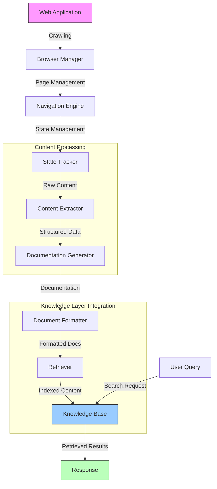

# 🕸️ Web Application Scraper

A module for automatically crawling web applications, extracting content, and generating documentation that integrates with the existing RAG (Retrieval-Augmented Generation) knowledge layer.

## Features

- **Web Crawling**: Crawl complex web applications including SPAs and JavaScript-heavy sites
- **Content Extraction**: Extract text, UI components, and user workflows
- **Documentation Generation**: Generate structured documentation from extracted content
- **Knowledge Layer Integration**: Seamlessly feed generated documentation into the existing RAG system

## Getting Started

### Prerequisites

- Node.js 16+
- Playwright dependencies (can be installed with `npx playwright install`)

### Installation

This module is part of the larger RAG application. No separate installation is needed.

### Basic Usage

```typescript
import { WebAppScraper } from '@/lib/web-scraper';
import { Retriever } from '@/lib/rag/retriever';

async function main() {
  // Create scraper instance
  const scraper = new WebAppScraper({
    crawler: {
      baseUrl: 'https://example.com',
      maxDepth: 3
    },
    extraction: {
      captureScreenshots: true,
      detectWorkflows: true
    }
  });
  
  // Start crawling
  await scraper.start();
  
  // Generate documentation
  const documents = await scraper.generateDocumentation();
  
  // Index in knowledge layer
  const retriever = new Retriever();
  await retriever.indexDocuments(documents);
  
  console.log(`Indexed ${documents.length} documents from web application`);
}
```

## Architecture

The web scraper consists of several core components:

### Browser Management

The `BrowserManager` class handles browser initialization, page creation, and resource cleanup.

### Navigation Engine

The `NavigationEngine` manages the crawling process, including URL queue management, page processing, and link extraction.

### State Tracking

The `StateTracker` keeps track of visited pages, captures page state, and detects content changes.

### Content Extraction

*(Coming in next phase)* Extracts structured content from web pages, including text, UI components, and workflows.

### Authentication Handling

*(Coming in next phase)* Handles login forms and OTP challenges during the crawling process.

### Documentation Generation

*(Coming in next phase)* Generates structured documentation from extracted content.

## Integration with Knowledge Layer

The web scraper integrates with the existing knowledge layer:

1. Crawls web applications and extracts content
2. Generates structured documentation
3. Formats documents to match the `Document` interface
4. Uses the existing `Retriever` to index documents
5. Enables querying through the standard knowledge API

## Flow Diagram

Below is the detailed flow of how the web scraper works and integrates with the knowledge layer:



The diagram shows:
1. The crawling process starts with the target web application
2. Browser Manager handles browser sessions and page loading
3. Navigation Engine manages the crawling strategy and URL processing
4. State Tracker monitors page changes and maintains crawl state
5. Content is extracted and processed into structured documentation
6. Documentation is formatted to match the knowledge layer's requirements
7. Retriever indexes the content into the knowledge base
8. Users can query the enriched knowledge base through the standard API

## Current Status

This is the initial implementation focusing on the core crawling infrastructure. Future phases will add:

- Enhanced content extraction
- Authentication handling
- Documentation generation with LLM enhancement
- Change detection and versioning

## Example

See the [example.ts](./example.ts) file for a complete usage example.

## License

This project is licensed under the terms of the license included with the main application. 